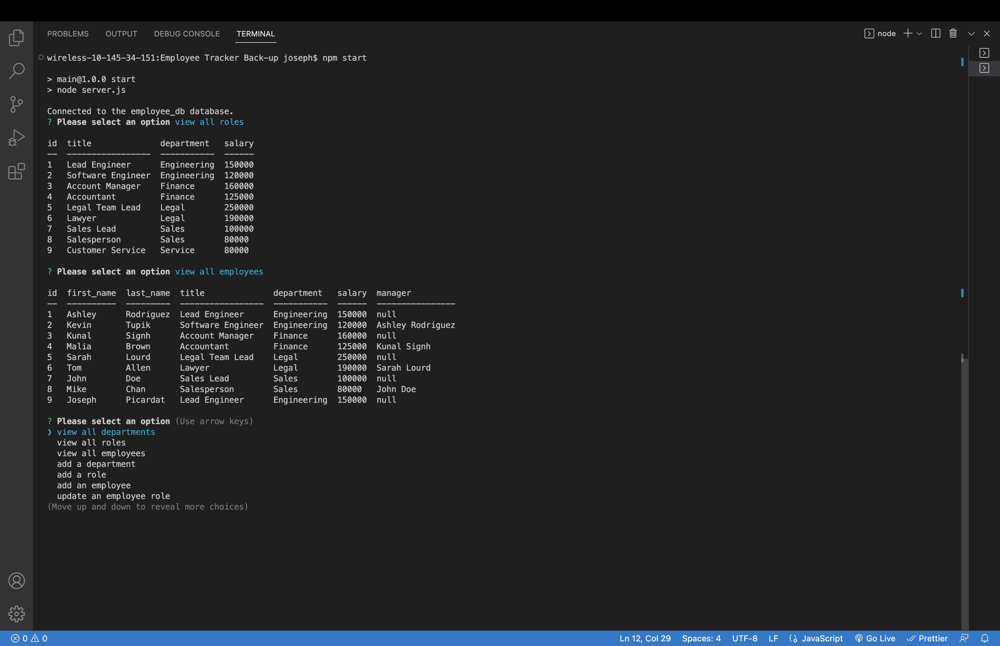

# EmployeeIO

  ## Description

  What was my motivation?
  - To generate a database that is connected by three tables.

  Why did I build this project?
  - To learn how to apply mySQL to a real world scenario

  What problem does it solve?
  - It solves the problem of a normal spreadsheet, by getting rid of the task of scrolling to find the information needed and instead gives a simple UI that is easy to understand

  What did I learn?
  - I learned how to join three different tables as well as self-join one of them. Not only did I learn how to do that, I learned how to connect a user interface with the data stored by mysql.
  

  ## Table of Contents

  - [Installation](#installation)
  - [Usage](#usage)
  - [Contributing](#contributing)
  - [Tests](#tests)
  - [Questions](#questions)
  - [License](#license)

  ## Installation

1. Put in your password to mySQL on line 12 of index.js within the single quotes marked -> `password: ''`
2. Open intergrated terminal by right-clicking server.js and clicking on 'open intergrated terminal.'
3. Type 'npm i'
4. Then type 'npm i inquirer@8.2.4' (You have to download this lower version due to how this program works)
5. Log into mysql by typing 'mysql -u -root -p' to create the database, table, and seeds.
6. Type 'SOURCE schema.sql' to generate the database and tables
7. Type 'SOURCE seeds.sql' to add the data into the database and tables
8. Type 'exit'
9. Then preceed with 'npm start' to start the application
10. Follow along with the given options
11. Enjoy the simplicity!

  ## Usage

  Video Walkthrough Link: https://drive.google.com/file/d/1sjO0EtAYuT3msxllkdyJFq51_ejoHU0o/view?usp=sharing

  

  ## Contributing

  No contributors, just myself and I

  ## Tests

  No Tests for this application

  ## Questions

  Github Profile: josephpicardat

  If you need to reach me, you can with through my email: josephpicardat1@gmail.com

  ## License

  
  (https://opensource.org/licenses/MIT)

  Copyright 2022 Joseph Picardat

  Permission is hereby granted, free of charge, to any person obtaining a copy of this software and associated documentation files (the "Software"), to deal in the Software without restriction, including without limitation the rights to use, copy, modify, merge, publish, distribute, sublicense, and/or sell copies of the Software, and to permit persons to whom the Software is furnished to do so, subject to the following conditions:

    The above copyright notice and this permission notice shall be included in all copies or substantial portions of the Software.
    
    THE SOFTWARE IS PROVIDED "AS IS", WITHOUT WARRANTY OF ANY KIND, EXPRESS OR IMPLIED, INCLUDING BUT NOT LIMITED TO THE WARRANTIES OF MERCHANTABILITY, FITNESS FOR A PARTICULAR PURPOSE AND NONINFRINGEMENT. IN NO EVENT SHALL THE AUTHORS OR COPYRIGHT HOLDERS BE LIABLE FOR ANY CLAIM, DAMAGES OR OTHER LIABILITY, WHETHER IN AN ACTION OF CONTRACT, TORT OR OTHERWISE, ARISING FROM, OUT OF OR IN CONNECTION WITH THE SOFTWARE OR THE USE OR OTHER DEALINGS IN THE SOFTWARE.

